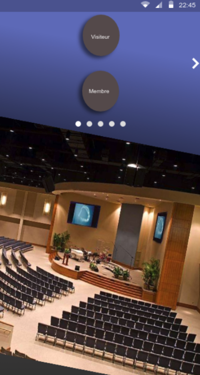

# Bienvenue shalom_front
-----------------------------------------------

Création d'une application mobile

------------------------------------------------

## Installation 

### Front-end

* Cloner le projet 
* Npm install
* Npm run start 
* Télécharger l'application expo sur IOS ou Android , scanner le QR code

### Back-end

Utiliser le repo : [Github](https://github.com/mtnana/shalom_BackEnd)

------------------------------------------------

## Languages utilisés 

* React Native
* NodeJs
* Base de données : Firebase 

------------------------------------------------